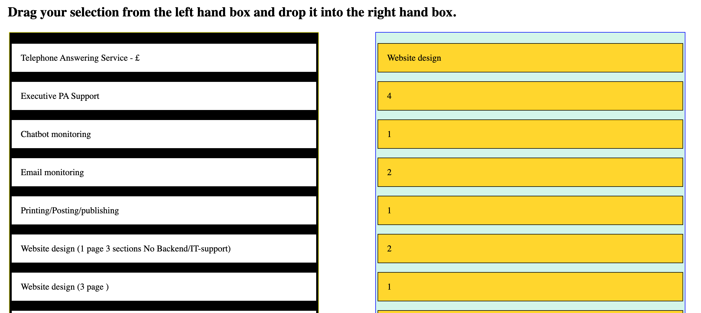
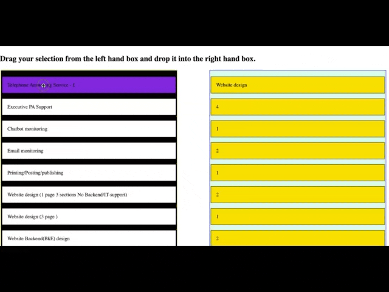

# 📝 Drag and Drop
## Description
 This is an application which will allow you to sort boxes or items into a list or move then across to another list.

##  📖 How to Use 
### Moving tiles in the Drag and Drop app:

```
- Click and hold the Tile which has the information you wish to move.
-Then move the item to the position in the list you would like it to be placed.
- You can also move the tile across to the other list. 
- You will note that when you over an item it turns purple and when you let go it returns to a white tile.
- When you move the tile across to the other list it takes on the colour of the other tiles in the list, which in this case is yellow.
```

### How this app might be used.

```
- To create a sortable shopping list
- Create a game where the player sorts the answers in order of highest to lowest, biggest to smallest, oldest to youngest etc
- To select items and place them on a list and with a little javascrip adds up the price of the items selected. 
- Let me know what you come up with.
```


## 📷 Screenshots

Here is a screenshot of the Sortable tiles


                                                                                             

##  🎞️ Short film

```
---

This short film demonstrates the application in action.

```
### 🔗 Links
[](https://abrics.github.io/AbriCS/Note-Taker)

### Author
- [@AbriCS](https://www.github.com/AbriCS)

### Acknowledgements

 - [Awesome Readme Templates](https://awesomeopensource.com/project/elangosundar/awesome-README-templates)
 - [Build a Sortable App](https://www.youtube.com/watch?v=jfYWwQrtzzY)  
 - [Emoji Icons](https://github.com/ikatyang/emoji-cheat-sheet/blob/master/README.md)

